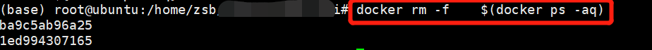
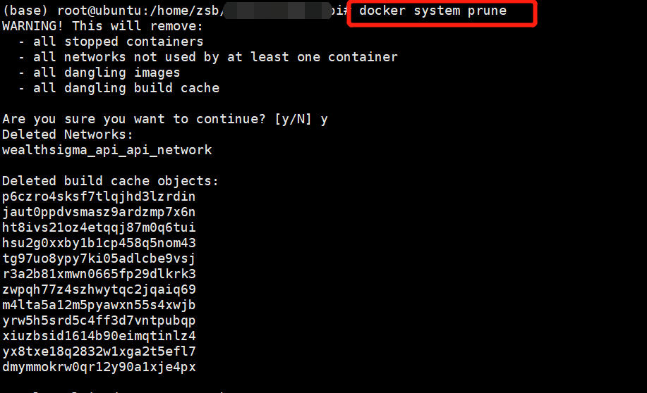
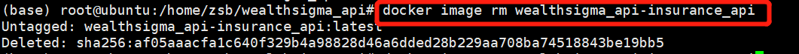
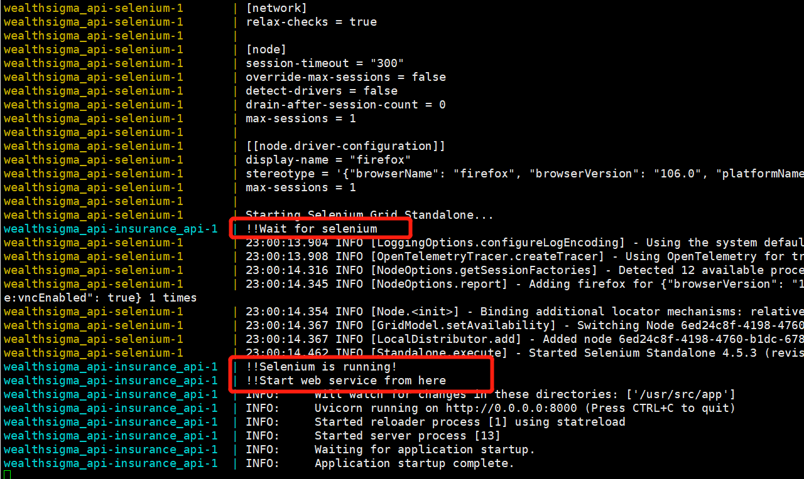
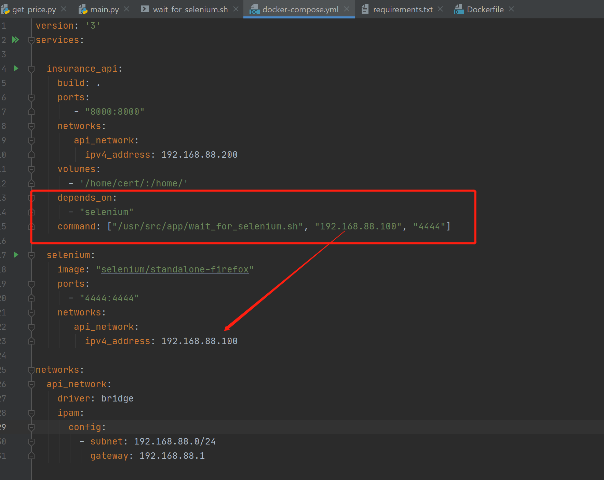

# Docker_compose_API
Create an API for providing insurance price. 
Technical environment: Docker compose, FastAPI, Selenium

# Docker compose file
## Code
Define the network as 192.168.88.x
~~~
networks:
  api_network:
    driver: bridge
    ipam:
      config:
        - subnet: 192.168.88.0/24
          gateway: 192.168.88.1
~~~

Define the contain IP address as 192.168.88.200
~~~
    networks:
       api_network:
         ipv4_address: 192.168.88.200
~~~

Map the local folder `/home/cert/` to the contain folder `/home/`.
~~~
    volumes:
      - '/home/cert/:/home/'
~~~

## Netwrok

# How to run it?
## Clear my environment
Run the command `docker rm -f    $(docker ps -aq)` to delete all the containers in my host.

Run the command `docker  system prune`

Run the command `docker image rm XXX` to delete the image.

You don't need to do the command as above. You can only run this command 'docker compose down --rmi all -v --remove-orphans' to clean your images and containers created by your docker-compose.yaml.

Run the command `docker compose up` or `docker compose up -d` the start the two containers named selenium and insurance_api.

You will find the container named insurance_api only start after the container named selenium.

Becuase we set the insurance_api container depends with the selenium container service in the docker-compose.yaml file.

## Docker 

# Connet with Selenium container
~~~
        with open("/home/config.txt", "r") as f:
            credentials = f.readline().split(" ")
        driver = webdriver.Remote(
            command_executor="http://192.168.88.100:4444/wd/hub",
            options=webdriver.FirefoxOptions()
        )
~~~

# Use this API
Input the JSON format message and POST it. For example: 
~~~
{
    "expiry_date":"2023-12-25",
    "birthday":"2011-01-01",
    "effective_date":"2023-10-20"
}
~~~

****
